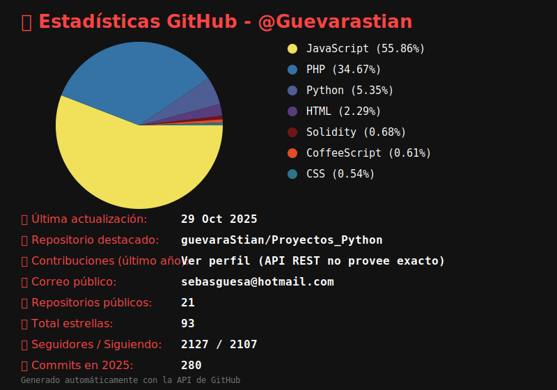

Sebastian Guevara Sanchez - Colombia - sebasguesa@hotmail.com

Ingeniero de sistemas, Desarrollador de software, Fullstack en diferentes lenguajes de programacion, me apasiona la Ciberseguridad y tengo conocimientos en Blockchain.

Manejo de programas de diseño de software UML. Conocimiento en HTML y CSS.
Conocedor de lenguaje de programación Java, PHP, Python, JavaScript, R, Go y Ruby.
Conocimiento en frameworks Angular, VueJs, Laravel, Flask, Django y Rails. 
Manejo de Base de datos SQL y NoSql, tambien conexión JDBC.

Manejo de servidores Windows y Linux. Control de versiones GIT y CVS.
Conocimiento de instalación y mantenimiento a Redes de computadores CCNA, Soporte técnico a computadores y operario de AS400.

Conocimientos en Ciberseguridad, control de programas de intrusión a Redes de información y manejo de algunos temas criptografícos.
Programo software con tecnología Blockchain. Conocimiento en formulación y gestión de proyectos PMI y seguimiento PMBOK con ofimática. 

Les recomiendo, la siguiente herramienta de windows, process monitor, ayuda a grabar los procesos de un computador, y luego guardarlo en csv para posteriormente ser usados como prueba de robo de informacion. https://learn.microsoft.com/es-es/sysinternals/downloads/procmon . los procesos svchost, msedge y wininint, son los mas usados para esconder un hackeo

------------ 
Front-End

    

------------ 
Back-end 

  

    
  

              

---------------------
 
Servidores

           

-----------------------

  

